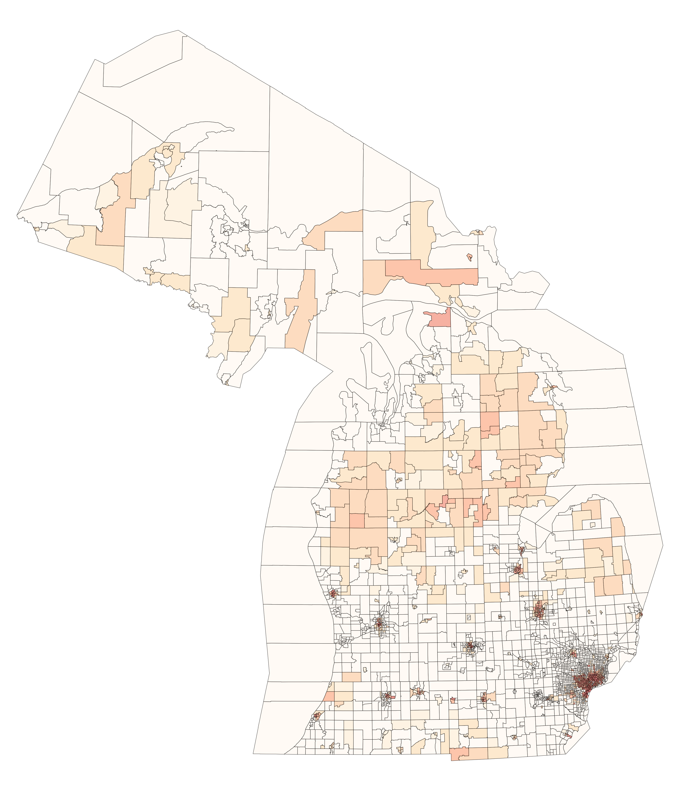

# Identifying Cumulative Climate and Energy Burdens by Census Tracts in Michigan

The Justice40 Initiative aims to direct 40% of climate-related federal funding to low income and under-served communities.

This project uses the Climate and Economic Justice Screening Tool data to identify cumulative burdens across 2,813 Michigan census tracts with the intent of optimizing funding impacts on a state level.

### 1. Qualitative Analysis
The project began through an exploratory effort to analyze the Communities data provided by the Climate and Economic Justice Screening Tool from interviews of industry professionals that are familiar with the data.

### 2. Evaluating the Environmental Justice Communities Data for Michigan
The communities list data is an aggregation of data sources that is vetted and managed by the Council on Environmental Quality to support the Justice40 Initiative executive order by matching disadvantaged communities with "burdens in eight categories: climate change, energy, health, housing, legacy pollution, transportation, water and wastewater, and workforce development." The data is visualized through the Climate and Economic Justice Screening Tool, developed by the Department of Digital Services, and it provides a means of geographically associating these burdens through a map. Each record represents a specific census tract from 2010 that includes data points county, state, race percentages, environmental and socio-economic burden percentiles, and flags that represent whether the data meets burden thresholds.

The data can be downloaded in CSV, Excel, and shapefile at  Downloads - Climate & Economic Justice Screening Tool (geoplatform.gov) Opens in a new tab 
The codebase that aggregates data and supports the Climate and Economic Justice Screening Tool is available on Github at  usds/justice40-tool: A tool to identify disadvantaged communities due to environmental, socioeconomic and health burdens (github.com) Opens in a new tab 

Additionally, to plot this data, we need a shapefile provided by the US Census for 2010 tract data. This data is provided through the Census.gov website.

- [Communities 1.0 Csv - EJ & Screening Tool](https://screeningtool.geoplatform.gov/en/downloads#3/33.47/-97.5)
- [2010 Census Tract - census.gov](https://www.census.gov/cgi-bin/geo/shapefiles/index.php?year=2010&layergroup=Census+Tracts)

### 3. Cleaning the Data Set
The communities data is fairly clean, but for the sake of our anlysis, we need to isolate the important columns for our analysis, and rename the census tract ID column so that it can be merged later. We then filter against the 'State/Territory' field anything that isn't a Michigan related row.

The communities data maps against 8 burdens, but does not provide a flag in the dataset to identify whether the burden was met. These include
- Climate
- Energy
- Transportation
- Pollution
- Water
- Health
- Housing
- Workforce

### Continued Support for this Research
| Haviland Software, LLC | Unified Ground |
| -- | -- |
| [havilandsoftware.com](https://www.havilandsoftware.com) | [unifiedground.com](https://www.unifiedground.com) |
|  |  |

